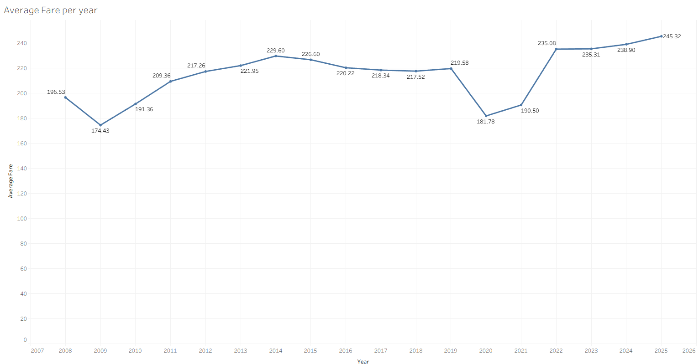
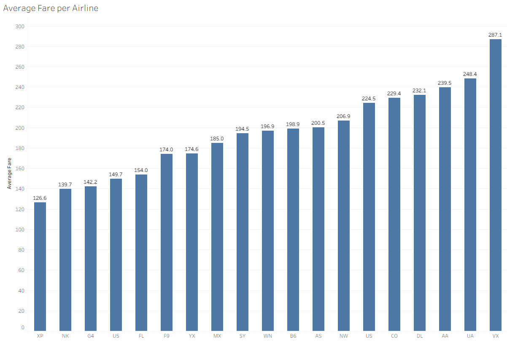
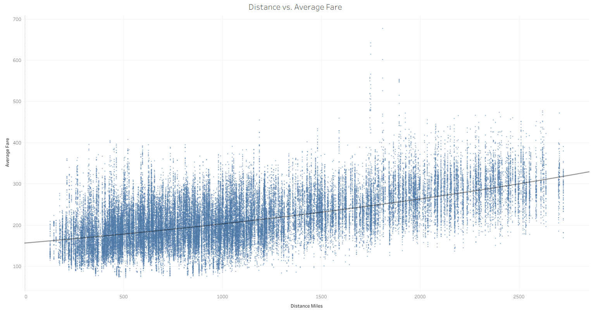
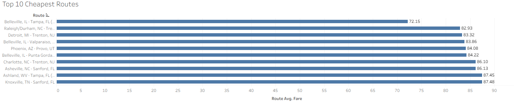
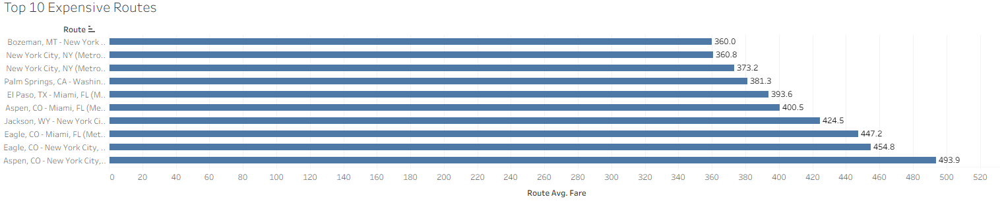
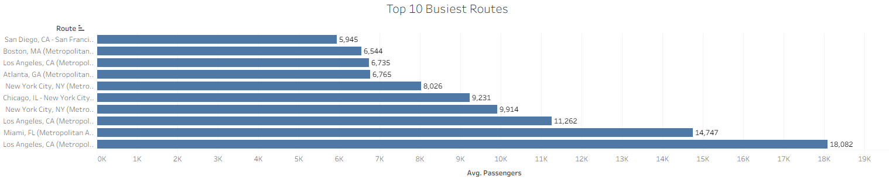
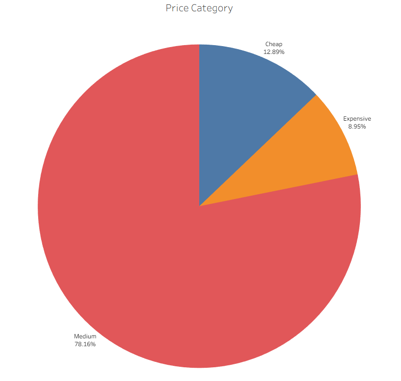

# US-Airfare-SQL-analysis

## Overview
This project analyzes the United States domestic airline airfare data from 2008 to 2025 using SQL and Tableau.

The goal is to discover pricing trends, airline performance, and route costs using real-world data.

## Tools Used
- SQL
- Tableau Public
- GitHub

## Queries
- Average fare by year
- Average fare by airline
- Distance vs. Average Fare
- Top 10 Cheapest Routes
- Top 10 Expensive Routes
- Top 10 Busiest Routes (Based on Average Passenger Count)
- Case statement to categorize the average fares into three tiers: Cheap, Medium, Expensive

## Visualizations

### Average Fare by Year

### Average Fare per Airline

### Distance vs. Average Fare

### Top 10 Cheapest Routes

### Top 10 Expensive Routes

### Top 10 Busiest Routes

### Price Category

